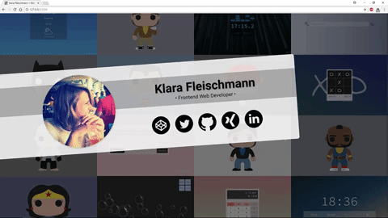

## Round 2 | Daily Log

### **D64-66 #100DaysOfCode // Mar092018 - Mar112018**

**resources/learnings**  
* UNDERSTANDING ECMASCRIPT 4: Expanded Object Functionality  
  * Object Categories  
  * Object Literal Syntax Extensions  
  * New Methods  
  * Duplicate Object Literal Properties  
  * Own Property Enumerations Order  
  * Enhancements for Prototypes  
  * A Formal Method Definition  
* UNDERSTANDING ECMASCRIPT 5: Destructuring for Easier Data Access  
  * Why is destructuring useful?  
  * Object Destructuring  
  * Array Destructuring  
  * Mixed Destructuring  
  * Destructured Parameters

**coding**  
* Personal Portfolio v2.0
  * basic boilerplate & favicon  
  * nav & basic styling  
  * hero

**other**
* successfully installed Jekyll on my Windows System :wink:

» *6h*

### **D63 #100DaysOfCode // Mar082018**

**resources/learnings**  
* The Web Developer Bootcamp: Deploying  
  * Intro to Deploying  
  * Deploying a Simple Demo App  
  * Deploying YelpCamp  
  * Environment Variables  

» *1.5h*

### **D56-62 #100DaysOfCode // Mar012018 - Mar072018**

**resources/learnings**  
* The Web Developer Bootcamp: YelpCamp  
  * Adding Authentication  
  * Refactoring Routes  
  * User Associations (Campgrounds, Comments)  
  * Update & Destroy incl. Authorization (Campgrounds, Comments)  
  * Refactoring Middleware  
  * Flash Messages & "helpful errors"  
  * Styling Landing Page & Login/SignUp Form  
* UNDERSTANDING ECMASCRIPT 3: Functions  
  * Capabilities of function constructor  
  * the spread operator & the name property  
  * dual purpose of functions  
  * block-level functions & arrow functions  
  * tail call optimization

**coding**  
* Scribble: [Lightbox](https://codepen.io/miffili/pen/BYeMoB "view pen on CodePen")  
* Scribble: [Overlay w/ Mouse-Over-Effect](https://codepen.io/miffili/pen/VQoeNr "view pen in CodePen")  
* Test: Grid Poster Layout (unfinished)  
* cleanup freeCodeCamp FED project (weaterapp)

**other**  
* Web Portfolio  
  * Content  
  * Language decision :laughing:  

» *16.5h*

### **D55 #100DaysOfCode // Feb282018**

**resources/learnings**  
* The Web Developer Bootcamp: YelpCamp  
  * Basics (Initial Routes, NEW & CREATE, Layout, Styling)  
  * Data Persistence (Mongoose, SHOW)  
  * Comments (Seeding the DB, Comment Model, New & CREATE comments, Styling)  
* The Web Developer Bootcamp: Authentication  
  * Intro to Authentication  
  * Tools to use  
  * Simple Authentication Demo

» *6h*

### **D54 #100DaysOfCode // Feb272018**

**resources/learnings**  
* The Web Developer Bootcamp: Databases  
  * Intro DB  
  * Intro MongoDB  
  * First Mongo Commands  
  * Mongoose  
* The Web Developer Bootcamp: RESTful Routing  
  * Intro  
  * 7 RESTful routes  
  * Add every type of RESTful routes to a Blog Demo  
  * other fun stuff: CRUD, sanitize user input, ...  
* The Web Developer Bootcamp: Data Associations  
  * Intro  
  * Embedding data  
  * Referencing data  
  * module.exports

» *5.5h*

### **D53 #100DaysOfCode // Feb262018**

**resources/learnings**  
* The Web Developer Bootcamp: Working with APIs  
  * Intro  
  * JSON & XML  
  * Making API Requests  
  * Movie API App

**other**  
* Web Portfolio  
  * researched  
  * sketched out ideas  
  * planned out content  

» *2.5h*

<!-- Took 3 days off, because I had to reflect & plan.  --> :innocent:

### **D52 #100DaysOfCode // Feb222018**

**coding**  
* Simon Game for freeCodeCamp  
  * added glow animation to all bubbles & (almost) fixed a bug regarding multiple clicks on a bubble  
  * added GameOver overlay & functionalities  
  * made the whole web app responsive via the CSS function calc() :heart_eyes:  
  * cleaned up the whole code

**other**  
* claimed the [Front End Development Certificate](https://www.freecodecamp.org/miffili) on freeCodeCamp

[📺 Live Preview](https://miffili.github.io/freeCodeCamp/FED-simongame/ "live preview")  
[Build a Simon Game project on GitHub](https://github.com/Miffili/freeCodeCamp/tree/gh-pages/FED-simongame "project")

» *5h*

### **D51 #100DaysOfCode // Feb212018**

**coding**  
* Simon Game for freeCodeCamp  
  * wired start/reset Btn  
  * wired strict Btn  
  * finished gameplay  
  * changed on/off sphere to animation sphere on codepen (two pens)

» *5h*

### **D50 #100DaysOfCode // Feb202018**

**coding**  
* Simon Game for freeCodeCamp  
  * added sound to bubbles  
  * gameplay of the computer almost done  
  * started gameplay of the user

» *4h*

### **D47-49 #100DaysOfCode // Feb172018 - Feb192018**

**resources/learnings**  
* The Web Developer Bootcamp: Intermediate Express  
  * learned about .ejs files & coded templates  
  * distinction between `<%= ... %>` & `<% ... %>` in ejs files  
  * learned about public assets & connecting them properly  
  * set up a post-route  
* The Complete MySQL Developer Course: Creating Databases & Introduction to Queries  
  * Create Database/Schema  
  * Work with Tables  
  * Inserting Rows  
  * Select  
  * Concat, Substring()  
  * Limit, Order By, Distinct  
  * Count, Like  
  * Max, Min

» *5h*

### **D46 #100DaysOfCode // Feb162018**

**resources/learnings**  
* CSS Grid by Wes Bos 22, 25  
  * recreated codepen  
  * learned about usage of css variables  
  * used CSS `grid-areas` to make a responsive website

» *2h*

### **D45 #100DaysOfCode // Feb152018**

**resources/learnings**  
* The Web Developer Bootcamp  
  * Serverside frameworks » Express.js  
* CSS Grid by Wes Bos 21 & 23  
  * differences between flexbox & grid  
  * usage of css variables

» *2h*

### **D44 #100DaysOfCode // Feb142018**

**resources/learnings**  
* The Web Developer Bootcamp  
  * Node JS  
* CSS Grid by Wes Bos 19 & 20  
  * nesting grids  
  * responsive design using `auto-fit` & `minmax`  
  * stacking grids  
  * `object-fit`

» *3h*

### **D43 #100DaysOfCode // Feb132018**

**resources/learnings**  
* The Web Developer Bootcamp  
  * Backend Basics  
  * The Command Line  
  * Git & GitHub  
  * JavaScript: The Tricky Stuff

**coding**  
* Simon Game  
  * altered the structure of the html for better JS handling  
  * worked on the glow effect of the "buttons"

» *5h*

### **D42 #100DaysOfCode // Feb122018**

**research**  
* sounds for Simon Game for freeCodeCamp  
* reacquainted myself with my code from a few weeks ago for the project

**other**  
* created repo for my website & pushed content from landing page to it  
* connected it to my personal domain http://www.klarafleischmann.de

» *2.5h*

### **D41 #100DaysOfCode // Feb112018**

**coding**   
* TicTacToe  
  * added details  
  * cleaned up code  
  * add responsiveness  
  * published project on [github](https://github.com/Miffili/freeCodeCamp/tree/gh-pages/FED-tictactoe) & [codepen](https://codepen.io/miffili/full/LQyyvo/)

» *2.5h*

### **D40 #100DaysOfCode // Feb102018**

**resources/learnings**  
* [CSS GRID by Wes Bos](https://cssgrid.io/): 14 - 18  
  * `grid-template-areas`  
  * naming lines in CSS grid  
  * `grid-auto-flow: dense;`  
  * CSS grid alignment & centering  
  * re-ordering items

**coding**   
* TicTacToe  
  * refactor all functions & clean up code  
  * add visual elements to gameplay/current turn

» *2.5h*

### **D39 #100DaysOfCode // Feb092018**

**coding**  
* LandingPage  
  * finishing touches (correct width on all devices & cleaning code)  
* TicTacToe  
  * add Game Over display + functionalities  
  * add "thinking time" to cpu move  
  * add random first move

» *5.5h*

### **D38 #100DaysOfCode // Feb082018**

**coding**  
* LandingPage  
  * add responsiveness

» *1.5h*

### **D37 #100DaysOfCode // Feb072018**

**coding**  
* LandingPage of my portfolio  
  * HTML  
  * a lot of CSS

» *6h*

### **D35/36 #100DaysOfCode // Feb052018/Feb062018**

**other**  
* added the Bubble Machine to LinkedIn  
* added a portfolio on my Xing profile, with many projects, short descriptions & relevant links  
* figured out branches, and that it's better to have a gh-page branch rather than adding `_config.yml` everywhere :innocent:

**research**  
* overview JavaScript frameworks
  * Vue.js  
  * React & React Native  
  * Angular.js  
  * Ember.js

» now I'm happy with all of my professional profiles as well as my github profile :blush:

### **D34 #100DaysOfCode // Feb042018**

**other**
* feed all projects on github with  
  * description of project  
  * link to live preview  
  * screenshot of user interface  
* added the Binary Timer and a summary of the freeCodeCamp projects to my LinkedIn profile  
* solved a messy problem with the redirecting of the github hosted website to my Strato hosted domain | well I managed to delete all connections for now  

» today I put a lot of work in my profiles and this will work towards getting a job in programming, therefore it's code related :innocent:

### **D33 #100DaysOfCode // Feb032018**

**coding**
* refactored JS code a bit  
* planned out all of the remaining steps on paper

**other**
* pushed all of the remaining projects on github  
* refactored old code while doing so

» *5h*

### **D32 #100DaysOfCode // Feb022018**

**resources/learnings**  
* [CSS GRID by Wes Bos](https://cssgrid.io/): 11 - 13  
  * spanning & placing  
  * `auto-fit` & `auto-fill`  
  * `minmax()`  

**other**
* learned how to use git cmd with [Try Git on codeschool](https://www.codeschool.com/courses/try-git)  
* pushed two of the fCC projects on GitHub with git cmd :innocent:

» *3.5h*

### **D31 #100DaysOfCode // Feb012018**

**resources/learnings**  
* [CSS GRID by Wes Bos](https://cssgrid.io/): 05 - 10  
  * implicit & explicit tracks again  
  * `grid-auto-flow`  
  * sizing track  
  * `repeat()`  
  * sizing & placing items

**designing**
* LandingPage for my website (4h)
  * learned hot to use Figma with the awesome tutorials by Scott Tolinski [Mastering Figma](https://www.youtube.com/watch?v=WFLRASMq_XY&list=PLLnpHn493BHFFqJTrBbx8trAsuI0U-16w)
  * designed my landing page with Figma

» *5h*

### **D30 #100DaysOfCode // Jan312018**

**resources/learnings**  
* [CSS GRID by Wes Bos](https://cssgrid.io/): 02 - 05  
  * CSS grid fundamentals  
  * CSS grid dev tools  
  * implicit & explicit tracks

» *1h*

### **D29 #100DaysOfCode // Jan302018**

**resources**  
* started with [CSS GRID by Wes Bos](https://cssgrid.io/): setup all resources

**coding**
* TicTacToe
  * implemented gameplay

» *1.5h*

### **D27/28 #100DaysOfCode // Jan282018/Jan292018**

**research**  
* concept of recursive functions [again]

**coding**
* a lot of algorithms using recursion to get to the bottom of the topic  
* TicTacToe
  * finally got the minimax algorithm to work

» *3h*

### **D26 #100DaysOfCode // Jan272018**

**research**  
* Function methods  
  * apply()  
  * bind()  
  * call()

» *1h*

### **D25 #100DaysOfCode // Jan262018**

**preparations**  
* Simon Game  
  * CSS Animation  
  * JS  ON/OFF Button incl. GlowSequences

» *2h*

### **D24 #100DaysOfCode // Jan252018**

**preparations**  
* Simon Game  
  * JS plan  
  * searched sound files

» *1.5h*

### **D23 #100DaysOfCode // Jan242018**

**coding**  
* 2 AASs: Pairwise & Exact Change  
* Simon Game  
  * basic styling

**research**  
* Simon Game
  * sounds & colors  

» *4h*

### **D22 #100DaysOfCode // Jan232018**

**coding**  
* AAS: refactor Symmetric Difference  
* Advanced Projects: Simon Game  
  * sketch out layout & project plan  
  * add favicon, because priorities :blush:  
  * build HTML  
* Scribble: Glowing Sphere  
  » [Scribbles| Glowing Sphere](https://codepen.io/miffili/full/ZvZVrZ/)

» *3h*

### **D21 #100DaysOfCode // Jan222018**

**research**
* Array.prototype.reduce()  
  * tutorials on youtube:  
    * [JavaScript Array Reduce in 4 Minutes](https://www.youtube.com/watch?v=tsIAyUQc8Ig&index=1&list=PLOBpLcek_ueGTHrs6yti1KjpJANVEGCo_)  
    * [Reduce basics - Part 3 of Functional Programming in JavaScript](https://www.youtube.com/watch?v=Wl98eZpkp-c&index=2&list=PLOBpLcek_ueGTHrs6yti1KjpJANVEGCo_)  
    * [Reduce Advanced - Part 4 of Functional Programming in JavaScript](https://www.youtube.com/watch?v=1DMolJ2FrNY&index=3&list=PLOBpLcek_ueGTHrs6yti1KjpJANVEGCo_)  
  * articles on medium
    * [Understanding Array.prototype.reduce() and recursion using apple pie](https://medium.freecodecamp.org/understanding-array-prototype-reduce-and-recursion-using-apple-pie-f60cde58ea51)  
    * [Reduce your fears about Array.reduce()](https://hackernoon.com/reduce-your-fears-about-array-reduce-629b334ab945)

» *1.5h*

### **D20 #100DaysOfCode // Jan212018**

**coding**  
* TicTacToe  
  * try to wrap my head around the min max algorithm, didn't work  
  * because it kinda frustrates me, I will put it on hold for the moment & take care of other projects on my list

» on a side note: got sick over night.

> "One of the best programming skills you can have is knowing when to walk away for a while." - Oscar Godson

» *1.5h*

### **D19 #100DaysOfCode // Jan202018**

**coding**  
* TicTacToe  
  * worked on advanced cpu -> mixmax caused knots in my brain :)  
* AAS: Pairwise  
  * wanted to use reduce() like suggested -> couldn't grasp it

Today, all day, my brain was like...  

» *3.5h*

### **D18 #100DaysOfCode // Jan192018**

**coding**  
* TicTacToe  
  * basic gameplay (dumb cpu)  
  * fixing some glitches  
* solved 1 AAS: No Repeats Please  

» *5h*

### **D17 #100DaysOfCode // Jan182018**

**coding**  
* TicTacToe  
  * even more styling  
  * basic functionalities (select symbol, update stats field, resets)  
* solved 1 AAS: Symmetric Difference  

» *4h*

### **D16 #100DaysOfCode // Jan172018**

**coding**  
* worked a little on the design for the Tic Tac Toe game  
* read about game strategies  
* checked for the click event

» *2.5h*

### **D15 #100DaysOfCode // Jan152018**

**resources/learnings**  
* Understanding ECMAScript 6 | III: Functions  
  * Default parameters, unnamed parameters, Rest Parameters  
* Mathematik für Informatiker  
  * Basic Logic and Operators

**blog / podcast**  
* basecs #5 [Stacks and Overflows](https://medium.com/basecs/stacks-and-overflows-dbcf7854dc67)  
* [basecs on CodeNewbie.org](https://www.codenewbie.org/basecs) S1:E7 "How do you make a stack overflow?" & S1:E8 "Stacks IRL"

» *2h*

### **D14 #100DaysOfCode // Jan142018**

**coding**  
* solved 2 AASs: Record Collection & Validate US Phone Numbers

**blog / podcast**  
* basecs #3 & #4 on medium What's a Linked List, Anyway? [Part1](https://medium.com/basecs/whats-a-linked-list-anyway-part-1-d8b7e6508b9d)[Part2](https://medium.com/basecs/whats-a-linked-list-anyway-part-2-131d96f71996)  
* [basecs on CodeNewbie.org](https://www.codenewbie.org/basecs) S1:E5 "Linked Lists in Your Apartment" & S1:E6 "A friendly intro to Big O Notation"

» *3.5h*

### **D13 #100DaysOfCode // Jan132018**

**coding**  
* solved 1 AAS: Inventory Update  
* design of TicTacToe game

» *2.5h*

### **D12 #100DaysOfCode // Jan122018**

**preparations**  
* notes for Advanced Algorithm Scripting  

**coding**  
* solved 2 Advanced Algorithms: Map the Depris & Make a Person  
* started "Validate US Phone Numbers"  
* added responsive behavior to Binary Timer

**see »** [AGDQ2018 Inspired Binary Timer](https://codepen.io/miffili/full/ppVVwQ/)

» *5h*

### **D10/11 #100DaysOfCode // Jan102018/Jan112018**

**preparations**  
* Structure for Tic Tac Toe

**podcast**  
* basecs on CodeNewbie.org [S1:E4 "Hexes & Colors"](https://www.codenewbie.org/basecs)

**coding**  
* Binary Timer inspired by the AGDQ2018 theme

**see »** [AGDQ2018 Inspired Binary Timer](https://codepen.io/miffili/full/ppVVwQ/)

» *7.5h*

### **D9 #100DaysOfCode // Jan092018**

**resources & learning**  
* Nature of Code | 2. Vectors/Forces  
  * applying forces to objects, like wind & gravity  

**coding**  
* Xs in p5\*js for Tic Tac Toe -> no luck yet

**preparations**  
* sketched out ideas for Tic Tac Toe

**podcast**  
* basecs on CodeNewbie.org [S1:E3 "Hex Queen?"](https://www.codenewbie.org/basecs)

» *4h*

### **D8 #100DaysOfCode // Jan082018**

**research**  
* The Module Pattern  
  * ["Mastering the Module Pattern" by Tedd Motto](https://toddmotto.com/mastering-the-module-pattern/#augmenting-modules)  
  * [How Do You Structure JavaScript? ...](https://css-tricks.com/how-do-you-structure-javascript-the-module-pattern-edition/)

**blog / podcast**  
* basecs #2 on medium [Hexes and Other Magical Numbers](https://medium.com/basecs/hexs-and-other-magical-numbers-9785bc26b7ee)  
* basecs on CodeNewbie.org [S1:E2 "What is encoding?"](https://www.codenewbie.org/basecs)

» *1h*

### **D7 #100DaysOfCode // Jan072018**

**coding**  
* Tic Tac Toe for freeCodeCamp  
  * sketched out game flow  
  * set up HTML structure  
  * set up basic CSS: Layout & rough styling  
  * pre selection fonts
  * thinking about using Perlin to draw Xs & Os in game field

» *2.5h*

### **D6 #100DaysOfCode // Jan062018**

**resources & learning**  
* The Coding Train (p5*js) | Playlist: 13. What is Perlin Noise  
  * 2D Perlin Noise  
  * noiseDetail()  
* The Coding Train (p5*js) | CC\#24 - Perlin noise flow field  
  * physics engine  
  * particles  
  * most importantly: I still have a lot to learn, so I'm going to implement creative coding in my weekly goals again

**coding**  
* Pomodoro Clock for freeCodeCamp  
  * cleaned op code  
  * added progress bar  
  * adjusted pointer look to indicate disabled buttons  
  * additional adjustments on UI
  * fixed a bug after feedback on twitter

* **see »** [Pomodoro Clock](https://codepen.io/miffili/full/mpqwpp/)

» *6h*

### **D5 #100DaysOfCode // Jan052018**

**coding**  
* Pomodoro Clock for freeCodeCamp  
  * note: I started this webapp (html & parts of CSS) in the last year, but refactored it basically :)  
  * used my new knowledge of planning an app  
  * almost used a random walker as background => definitely not appropriate

» *8h*

### **D4 #100DaysOfCode // Jan042018**

**resources & learnings**  
* The Complete JavaScript Course: lec 84-91 **→ DONE!**  
  * creating an own `forEach` function for a nodeList  
  * what the architecture of a big project looks like  
* The Coding Train (p5*js) | Playlist: 13. What is Perlin Noise  
  * what's Perlin noise  
  * noise vs random  
  * 1D Perlin noise graph  
  * 2D Perlin Noise  
  * noiseDetail()  
* Understanding ECMAScript 6 | III: Functions  
  * default values in functions

**coding**  
* explored the world of randomwalkers with Perlin noise some more

**see »** [Random Walker No. I](https://codepen.io/miffili/full/xpXqOW/)

» *4h*

### **D3 #100DaysOfCode // Jan032018**

**resources & learnings**  
* The Complete JavaScript Course: lec 73-83  
  * more about working with the Module Pattern  
  * new method: `insertAdjacentHTML`  
  * Event delegation, event bubbling, traversing the DOM  
* Understanding ECMAScript 6 | II: Strings & Regular Expressions  
  * Better Unicode support, other string & RegExp changes  
  * Template Literals  
* Finished the first section of Nature of Code, that I started yesterday  
  * Perlin noise

**coding**
* tinkered more with the randomwalker :)

» *4h*

### **D2 #100DaysOfCode // Jan022018**

**resources & learnings**  
* Nature of Code | 1. Introduction/Overview  
  * Using Vectors in p5\*js  
  * Building a physics engine in p5\*js

**coding**  
* different variations of the randomwalker

**see »** [Tweet](https://twitter.com/KlaraMiffili/status/948344930115686400)

» *2h*

### **D1 #100DaysOfCode // Jan012018**

**resources & learnings**  
* The Complete JavaScript Course: lec 67-72  
  * Module Pattern for writing big projects (still using ES5)  
  * Using IIFE's, creating an initialization function & setting up a proper data structure  
* Understanding ECMAScript 6 | Introduction & Chapter One (Block Bindings)  
  * Reading about the proper use of `let` & `const` & best practices

» *2h*
